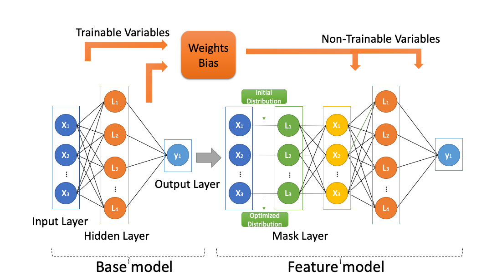

# Variance-Tolerance-Factors-for-Interpreting-All-Good-Neural-Networks

This repository is the official implementation of [Variance-Tolerance-Factors-for-Interpreting-ALL-Neural-Networks](https://arxiv.org/abs/2209.13858).
The structure of the framework is shown below. 



## Requirements

To install requirements:

```setup
pip install -r requirement.txt
```

## Usage

To train and test models, please follow the notebooks [Example](Example.ipynb).

Pretrained models and collected results are available in [Generated_weights](./Generated_weights).

Figure results are available in [results](./results).

## Citation

```
@INPROCEEDINGS{Li2023VTF,
  author={Li, Sichao and Barnard, Amanda},
  booktitle={2023 International Joint Conference on Neural Networks (IJCNN)}, 
  title={Variance Tolerance Factors For Interpreting All Neural Networks}, 
  year={2023},
  pages={1-9},
  doi={10.1109/IJCNN54540.2023.10191646}}
```


